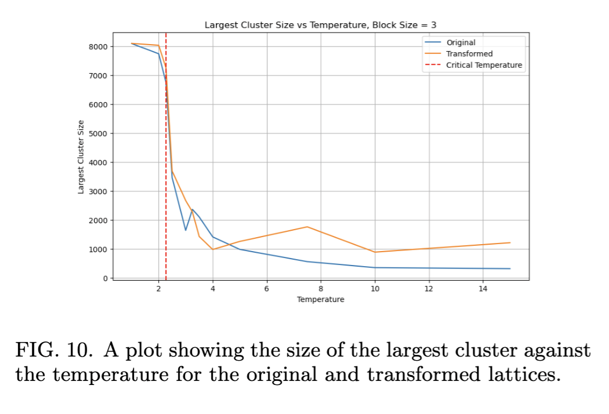
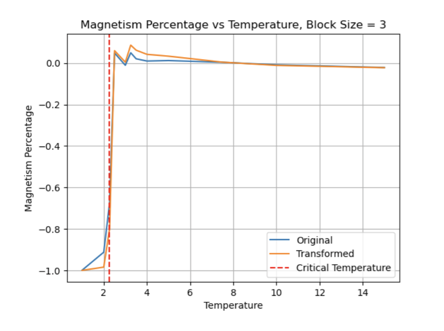

# Simulating the Ising Model and Block-Spin Transformations from Statistical Mechanics

Girish Krishnan | [LinkedIn](https://www.linkedin.com/in/girk/) | [GitHub](https://github.com/Girish-Krishnan)

*In collaboration with Blase Fencil and Zachary Sherman from UC San Diego.*

---

## Overview

This project implements simulations of the **Ising model**, a tool in statistical mechanics used to study ferromagnetic materials and phase transitions. It also explores block-spin transformations, a technique related to renormalization group theory, which provides insights into critical phenomena near phase transitions.

### Goals of the Project:

- Simulate the Ising model for various lattice sizes and temperatures.
- Visualize clustering behavior and magnetization as functions of temperature.
- Implement block-spin transformations to analyze the system’s behavior near critical points.
- Reproduce results from Schroeder’s textbook on statistical mechanics.

---

## Visual Highlights

### Evolution of the Ising Model

A 10x10 lattice simulated at \( T = 2.5 \) over 100,000 steps, showing the dynamic evolution of spin states.


### Block-Spin Transformation

Comparison of a 90x90 lattice at \( T = 2.5 \) and its transformed 30x30 version using block-spin transformations.


---

## How to Use

### Prerequisites

Ensure you have the following installed:

- Python 3.8+
- Jupyter Notebook
- Libraries: `numpy`, `matplotlib`, `scipy`, `numba`, `tqdm`

### Running the Code

1. Clone the repository:
   ```bash
   git clone https://github.com/Girish-Krishnan/Computational-Physics-Ising-Model.git
   cd Computational-Physics-Ising-Model
   ```

2. Open the Jupyter Notebooks:
   ```bash
   jupyter notebook
   ```

3. Navigate to the `Code/` directory and open:

   - `question8-26.ipynb`: Simulates the Ising model for various lattice sizes and temperatures.
   - `question8-32.ipynb`: Implements and visualizes block-spin transformations.

4. Run the notebooks cell by cell to observe the simulations and results.

---

## Detailed Report

For a comprehensive explanation of the project, including algorithms, theoretical background, and results, refer to the [Project Report (PDF)](./Project_Report.pdf).

### Key Results

#### Clustering Behavior

The largest cluster size increases as the system approaches the critical temperature, as shown below:



#### Magnetization

Magnetization vs temperature for the original and block-transformed lattices, showing the critical temperature at \( T_c \approx 2.27 \).



---

## References

This project references problems and concepts from Schroeder’s *Introduction to Thermal Physics* (1999). See the [Project Report (PDF)](./Project_Report.pdf) for detailed citations.

---

## License

This project is licensed under the MIT License. See `LICENSE` for more information.